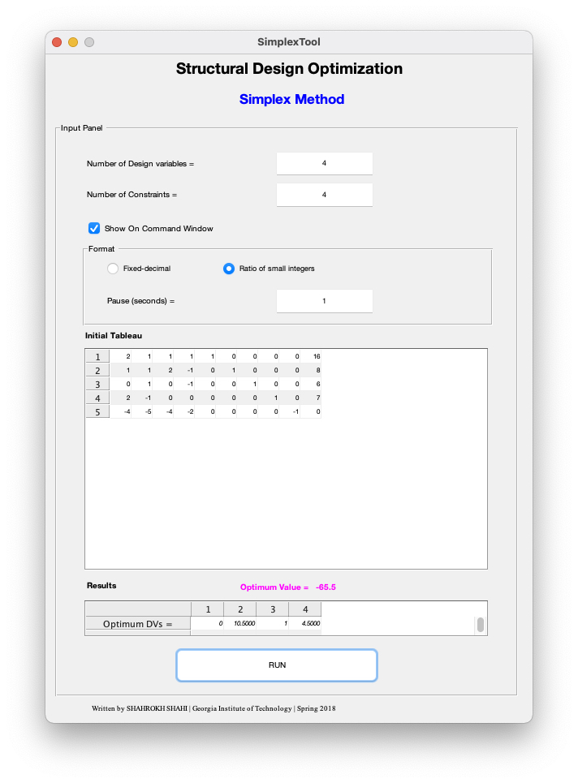

# Simplex Tableau Toolbox
An implementation of the <a  href="https://en.wikipedia.org/wiki/Simplex_algorithm" target="_blank">Simplex Tableau algorithm</a> for solving linear programming (LP) problems.

| 
Developed by Shahrokh Shahi
|
|:----------|
| 
Georgia Institute of Technology   College of Computing   2018
|
| 
<a  href="https://www.sshahi.com" target="_blank">www.sshahi.com
|

#### Details:
> This toolbox is part of the optimization visualizing series that I developed during the optimization class at Georgia Tech. More details about these toolboxes and packages is presented in <a href="http://www.sshahi.com/projects/tlbx-2-opt/" target="_blank">this blog post</a>.

----

### Sample run

----

### Install the toolbox on MATLAB
- Run "Simplex Toolbox.mltbx" in MATLAB and complete the installation
- Run simplexgui in MATLAB command window
- Enjoy! (The app will be run with a pre-set values as an example)

---

### Notes
-	The source codes are also available in __src__ folder.
-	Please note that the GUI is built and tested in Windows; there might be some visual differences in macOS (for instance, the test may appear smaller)
-	Please feel free to contact me if there is any problem or questions. 
----